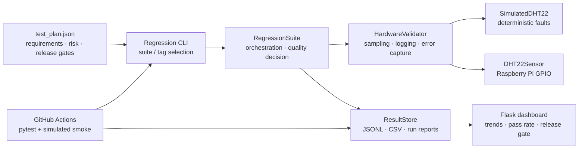

# Validation Platform Architecture

## Design decisions

| Component | Validation purpose |
| --- | --- |
| Declarative test plan | Requirement-to-test traceability, risk priority, selective execution, and release-gate policy |
| Hardware protocol | Keeps the orchestration layer independent of a specific sensor, board, or lab instrument |
| Simulation and fault injection | Enables deterministic CI coverage of negative paths without physical equipment |
| Structured evidence | Preserves readings, error context, environment, configuration, and test results for debug and audit |
| Dashboard | Converts raw evidence into engineering visibility: current state, trends, pass rate, and release decision |
| CI workflow | Prevents regressions in framework behavior before changes reach a lab or target platform |

## Scope statement

The DHT22 is a deliberately small demonstrator. The architectural pattern is intended for board bring-up, firmware interfaces, sensors, FPGA platforms, serial peripherals, and lab-connected validation equipment. Simulated evidence must never be presented as physical-hardware evidence.
